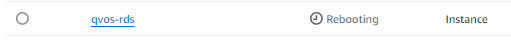

## 2. Rechercher l'ID de l'Instance RDS
Lancez la commande suivante pour voir les informations de vos instances RDS et confirmer leur ID :
```bash
PS C:\Users\kenti> aws rds describe-db-instances --query "DBInstances[*].[DBInstanceIdentifier,DBInstanceStatus]" --output table
-------------------------------------------------------
|                 DescribeDBInstances                 |
+----------------------------------------+------------+
|  clhuillier-tp06-ex01-nextcloud-db     |  available |
|  hjarry-nextcloud-db                   |  available |
|  lgarrabos-db                          |  available |
|  nextcloud-rds                         |  available |
|  qvos-rds                              |  available |
|  terraform-20241126081911507600000004  |  deleting  |
|  terraform-20241126090925716800000008  |  available |
|  terraform-20241126094937883400000005  |  available |
|  terraform-20241126095020403800000008  |  available |
|  terraform-20241126104621116900000001  |  modifying |
+----------------------------------------+------------+
```
L’ID de l’instance RDS est ici : qvos-rds.


```bash
PS C:\Users\kenti> aws rds reboot-db-instance --db-instance-identifier qvos-rds --force-failover
{
    "DBInstance": {
        "DBInstanceIdentifier": "qvos-rds",
        "DBInstanceClass": "db.t4g.micro",
        "Engine": "mysql",
        "DBInstanceStatus": "rebooting",
        "MasterUsername": "admin",
        "Endpoint": {
            "Address": "qvos-rds.c2oopr9eothp.eu-north-1.rds.amazonaws.com",
            "Port": 3306,
            "HostedZoneId": "Z3MPDEQW7KHUGY"
        },
[...]
```
Pour vérifier que le reboot a bien été pris en compte il faut se rendre sur le gui web.



```bash 
ubuntu@ip-10-0-4-106:~$ mysql -h qvos-rds.c2oopr9eothp.eu-north-1.rds.amazonaws.com -u admin -p
Enter password: 
Welcome to the MySQL monitor.  Commands end with ; or \g.
Your MySQL connection id is 11
Server version: 8.0.39 Source distribution

Copyright (c) 2000, 2024, Oracle and/or its affiliates.

Oracle is a registered trademark of Oracle Corporation and/or its
affiliates. Other names may be trademarks of their respective
owners.

Type 'help;' or '\h' for help. Type '\c' to clear the current input statement.

mysql> USE testdb;
Reading table information for completion of table and column names
You can turn off this feature to get a quicker startup with -A

Database changed
mysql> SELECT * FROM users;
+----+----------+
| id | name     |
+----+----------+
|  1 | John Doe |
|  2 | Jane Doe |
+----+----------+
2 rows in set (0.00 sec)

mysql> 


```
